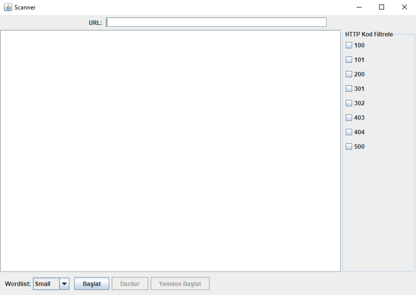

# DirBurst - Java URL Directory Scanner

**DirBurst** is a lightweight and fast URL directory scanner written in Java. It returns specific HTTP status codes using a wordlist and detects potentially accessible paths. It has a simple interface and easy-to-use structure.

---

## ❗ Legal Disclaimer

> This tool is developed **solely for educational, testing, and ethical hacking** purposes.  
> Any unauthorized usage may constitute a crime under applicable laws.  
> The developer accepts no responsibility for any misuse of this tool.

---

## 🚀 Features

- ✅ **Simple interface** – Easy to use via the command line
- 📂 **Wordlist support** – 3 different wordlists: small, medium, and large
- 🔎 **Filter specific HTTP codes** – Can filter 100, 101, 200, 301, 302, 403, 404, 500 HTTP status codes
- ⚡ **Fast and stable performance** – Lightweight and efficient structure

---

## ⚙️ Usage

- You can use it by cloning the project and running the `Main.java` file.

